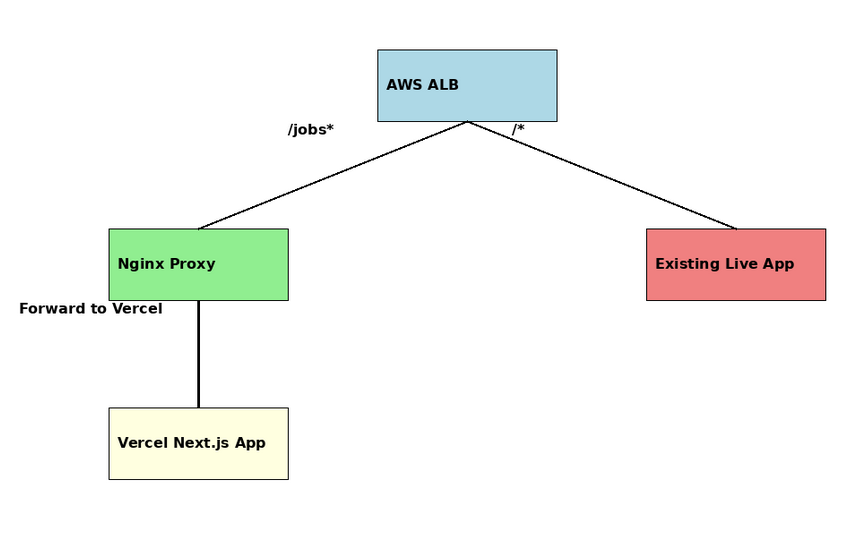

# CDK TypeScript Project with Nginx

## Prerequisites

- Node version: 22.12.0

This is a project for CDK development with TypeScript.

## AWS Configuration

Configure your AWS account in terminal:

```bash
aws configure
```

Provide the access key, secret access key and region.

## Required IAM Permissions

Ensure that your IAM user has the following permissions for deployment:

- AWSCloudFormationFullAccess
- AmazonS3FullAccess
- AmazonEC2FullAccess
- IAMFullAccess
- SSMFullAccess

## Installation and Deployment

Run the following commands in the project folder:

1. Install dependencies:

```bash
npm i
```

2. Make build:

```bash
tsc --build
```

3. Bootstrap the CDK:

```bash
cdk bootstrap
```

4. Deploy the CDK:

```bash
cdk deploy
```

## Network Architecture
The proposed architecture is designed to route user traffic efficiently and ensure seamless integration between the existing live website and the new NextJs application hosted on Vercel.


Below is a breakdown of the components and their roles:


Application Load Balancer (ALB):
- The ALB is the entry point for all incoming traffic.
- It uses path-based routing rules to direct requests:
🔹 Requests to /jobs* are routed to the Nginx Proxy.
🔹 All other requests (/*) are routed to the existing live application.


Nginx Proxy:
- The Nginx Proxy serves as an intermediary for requests to the /jobs* path.
- It forwards these requests to the new NextJs application hosted on Vercel.
- Nginx is deployed on AWS (either in an ECS cluster or as an EC2 instance) and can handle additional middleware tasks, such as caching, logging, or security headers, if required.


Existing Live Website:
- Traffic routed to the existing live website remains unaffected.
- The application continues to serve all paths except /jobs*.


Vercel-Hosted NextJs Application:
- The new NextJs application is hosted on Vercel to minimize operational overhead and leverage Vercel robust hosting features, including automatic scaling and global CDN distribution.
- Requests for the /jobs* path are processed here, providing users with the new functionality.


Networking and Security:
- The ALB is deployed in public subnets to handle external traffic.
- Nginx Proxy and other components are hosted in private subnets, ensuring controlled access.
- Security groups ensure secure communication between ALB, Nginx, and Vercel.


